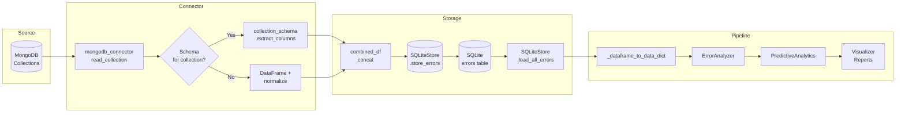

# Data Flow Diagram

## End-to-End Data Flow (MongoDB → SQLite → Analysis)

```
┌─────────────────────────────────────────────────────────────────────────────────────┐
│                              ENTRY: main.py / example_usage.py                       │
│                              ErrorAnalysisPipeline.run_full_analysis()               │
└─────────────────────────────────────────────┬───────────────────────────────────────┘
                                                │
                        ┌───────────────────────┴───────────────────────┐
                        │  data_source == 'mongodb' ?                  │
                        └───────────────────────┬───────────────────────┘
                                                │
            ┌───────────────────────────────────┼───────────────────────────────────┐
            │ YES                               │                                   │ NO (sqlite)
            ▼                                   │                                   ▼
┌───────────────────────┐                       │                       ┌───────────────────────┐
│ 1. MongoDBConnector   │                       │                       │ SQLiteStore           │
│    .connect()         │                       │                       │ .load_all_errors()    │
└───────────┬───────────┘                       │                       └───────────┬───────────┘
            │                                   │                                   │
            ▼                                   │                                   │
┌───────────────────────┐                       │                                   │
│ 2. read_multiple_     │                       │                                   │
│    collections()      │                       │                                   │
│    ['abc','cde',...]  │                       │                                   │
└───────────┬───────────┘                       │                                   │
            │                                   │                                   │
            │    For each collection:           │                                   │
            ▼                                   │                                   │
┌───────────────────────────────────────────────────────────────────────────────────┐
│ 3. read_collection(collection_name)                                                │
│    • cursor = collection.find() → list(documents)                                  │
│    • If schema exists: collection_schema.extract_columns(name, data) → DataFrame   │
│    • Else: DataFrame(data) + _normalize_nested_structure()                         │
│    • df['source_collection'] = collection_name                                     │
│    Output: data_dict = { 'abc': DataFrame, 'cde': DataFrame, ... }                 │
└───────────┬───────────────────────────────────────────────────────────────────────┘
            │
            ▼
┌───────────────────────┐
│ 4. combined_for_store │
│    = pd.concat(       │
│      [data_dict[c]    │
│       for c in        │
│       data_dict]      │
│    )                  │
└───────────┬───────────┘
            │
            ▼
┌───────────────────────┐
│ 5. SQLiteStore        │
│    .store_errors(     │
│      combined_for_    │
│      store            │
│    )                  │
│    • get_table_       │
│      columns()        │
│    • Filter df cols   │
│    • to_sql('errors') │
└───────────┬───────────┘
            │
            ▼
┌───────────────────────┐
│ 6. SQLiteStore        │
│    .load_all_errors() │
│    • SELECT * FROM    │
│      errors           │
│    • Parse timestamp  │
│    → combined_df     │
└───────────┬───────────┘
            │
            └───────────────────────────────────┬───────────────────────────────────┘
                                                │
                                                ▼
┌───────────────────────────────────────────────────────────────────────────────────┐
│ 7. _dataframe_to_data_dict(combined_df)                                            │
│    • groupby('source_collection')                                                   │
│    → data_dict = { 'abc': df_abc, 'cde': df_cde, ... }                              │
└───────────┬───────────────────────────────────────────────────────────────────────┘
            │
            ▼
┌───────────────────────┐
│ 8. ErrorAnalyzer      │
│    (data_dict)        │
│    • _combine_data()  │
│    • combined_df     │
│    • get_error_       │
│      patterns()       │
│    • get_summary_     │
│      statistics()     │
└───────────┬───────────┘
            │
            ▼
┌───────────────────────┐     Optional      ┌───────────────────────┐
│ 9. VectorStore        │◄──────────────────│ combined_df           │
│    .store_errors()    │                    └───────────────────────┘
└───────────────────────┘
            │
            ▼
┌───────────────────────┐
│10. PredictiveAnalytics│
│    (combined_df)      │
│    • prepare_features │
│    • train_error_     │
│      prediction_model│
│    • predict_future_  │
│      errors()         │
│    • predict_error_   │
│      reason_llm()     │
└───────────┬───────────┘
            │
            ▼
┌───────────────────────┐     ┌───────────────────────┐
│11. ErrorVisualizer    │     │ 12. main.py           │
│    • plot_*()         │     │     _generate_report()│
│    → output/*.png     │     │     → output/*.json   │
└───────────────────────┘     │         *.txt         │
                              └───────────────────────┘
```

---

## Focused Flow: MongoDB → collection_schema → SQLite Store

```
┌─────────────────────────────────────────────────────────────────────────────────┐
│                         MongoDB (Source of Truth)                                 │
│  Collections: abc, cde, ...                                                       │
│  Documents: { _id, rawData, errorType, timestamp, type, ... } or { event: {...}} │
└─────────────────────────────────────┬───────────────────────────────────────────┘
                                      │
                                      │ pymongo: collection.find()
                                      ▼
┌─────────────────────────────────────────────────────────────────────────────────┐
│  mongodb_connector.read_collection(collection_name)                              │
│  • data = list(cursor)  ← raw BSON documents                                     │
└─────────────────────────────────────┬───────────────────────────────────────────┘
                                      │
                    ┌─────────────────┴─────────────────┐
                    │ Schema defined for this           │
                    │ collection in collection_schema?  │
                    └─────────────────┬─────────────────┘
                          YES         │         NO
                    ┌─────────────────┴─────────────────┐
                    ▼                                   ▼
┌─────────────────────────────────────┐   ┌─────────────────────────────────────┐
│  collection_schema                  │   │  Default path:                      │
│  .extract_columns(collection_name,   │   │  • pd.DataFrame(data)                │
│                   data)              │   │  • _normalize_nested_structure()     │
│  • Uses schema.extractors            │   │  • errorCode → errorType             │
│  • Extracts only 4–8 columns        │   │  • event.header/body flattened       │
│  • Normalizes errorType, timestamp   │   └─────────────────────────────────────┘
│  • Adds source_collection           │
└─────────────────┬───────────────────┘
                  │
                  ▼
┌─────────────────────────────────────────────────────────────────────────────────┐
│  DataFrame per collection (e.g. abc, cde)                                        │
│  Columns: source_collection, errorType, timestamp, + schema fields (4–8 total)   │
└─────────────────────────────────────┬───────────────────────────────────────────┘
                                      │
                                      │ read_multiple_collections() returns
                                      │ data_dict = { 'abc': df_abc, 'cde': df_cde }
                                      ▼
┌─────────────────────────────────────────────────────────────────────────────────┐
│  main.py: combined_for_store = pd.concat([data_dict[c] for c in data_dict])      │
└─────────────────────────────────────┬───────────────────────────────────────────┘
                                      │
                                      ▼
┌─────────────────────────────────────────────────────────────────────────────────┐
│  SQLiteStore.store_errors(combined_for_store)                                    │
│  • get_table_columns('errors') → only columns that exist in table                │
│  • df_to_store = df[cols_to_store]                                               │
│  • timestamp → string for SQLite                                                 │
│  • df_to_store.to_sql('errors', if_exists='append')                               │
└─────────────────────────────────────┬───────────────────────────────────────────┘
                                      │
                                      ▼
┌─────────────────────────────────────────────────────────────────────────────────┐
│  SQLite (error_analytics.db)                                                      │
│  Table: errors (source_collection, errorType, timestamp, rawData, type, ...)     │
└─────────────────────────────────────┬───────────────────────────────────────────┘
                                      │
                                      │ Pipeline then loads from here
                                      ▼
┌─────────────────────────────────────────────────────────────────────────────────┐
│  SQLiteStore.load_all_errors()                                                   │
│  • pd.read_sql_query("SELECT * FROM errors", conn)                               │
│  • Drop id, created_at                                                            │
│  • timestamp → datetime                                                          │
│  → combined_df (used by ErrorAnalyzer, PredictiveAnalytics, etc.)               │
└─────────────────────────────────────────────────────────────────────────────────┘
```

---

## Mermaid Diagram (for GitHub / Mermaid-compatible viewers)



---

## Sequential Steps Summary

| Step | Component | Input | Output |
|------|-----------|--------|--------|
| 1 | MongoDB | — | Raw documents per collection |
| 2 | mongodb_connector.read_collection | collection_name, query, limit | list(documents) |
| 3 | collection_schema.extract_columns (if schema) | collection_name, documents | DataFrame (4–8 columns + source_collection) |
| 4 | mongodb_connector (else) | documents | DataFrame (normalized, + source_collection) |
| 5 | main.py | data_dict | combined_for_store = concat(DataFrames) |
| 6 | SQLiteStore.store_errors | combined_for_store | Rows in SQLite `errors` table |
| 7 | SQLiteStore.load_all_errors | — | combined_df (from SQLite) |
| 8 | main._dataframe_to_data_dict | combined_df | data_dict (by source_collection) |
| 9 | ErrorAnalyzer | data_dict | patterns, summary, combined_df |
| 10 | VectorStore (optional) | combined_df | Embeddings in vector DB |
| 11 | PredictiveAnalytics | combined_df | ML results, predictions, LLM analysis |
| 12 | ErrorVisualizer + main | patterns, model_results, etc. | **Final deliverables** (see below) |

### Final deliverables (useful outputs)

| Deliverable | Description |
|-------------|-------------|
| **PNG** | Charts: error frequency, temporal trends, dashboard, model performance |
| **JSON** | `analysis_report.json` — patterns, predictions, recommendations, LLM analysis |
| **Report (TXT)** | `analysis_report.txt` — human-readable summary for email or sharing |
| **Email / Report** | Use reports to trigger email alerts or attach to stakeholder reports |

---

## What You Need for This Flow

1. **MongoDB** – running, with collections (e.g. abc, cde).
2. **collection_schema.py** – schemas for each collection defining 4–8 columns and extractors.
3. **mongodb_connector.py** – connects, reads collections, uses schema when present.
4. **sqlite_store.py** – `store_errors()` to write combined DataFrame, `load_all_errors()` to read back.
5. **main.py** – orchestrates: read → store → load from SQLite → build data_dict → run ErrorAnalyzer and rest of pipeline.
6. **error_analyzer.py** – consumes data_dict (from SQLite or in-memory).
7. **predictive_analytics.py** – consumes combined_df.
8. **visualizer.py** – consumes analysis results.
9. **Optional:** vector_store.py if you want embeddings stored in a vector DB.

All of these are already present in the project; the diagram above describes how they connect from MongoDB → collection_schema → SQLite store → rest of the pipeline.
